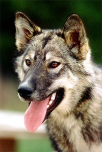
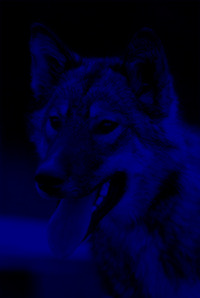
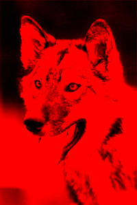
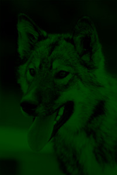

# color-filter
This a go package to apply a color filter to a image made in go

### Description:
The first implementation will acept only ppm images, the objective of this proyect is to apply concurrency patters to filter an image by an rgb color filter.

To start it will consise of 3 go routines, one for every RGB value (Red, Green, Blue)

The input image will be readed in n bytes block, specified by the user. Every go routine will read the image that number of bytes at a time.

The output will be 3 distinct images (red, blue, green). 

Additionally there are 3 additional options *-r value* , *-g value* and *-b value* that scale the intensity of the color for the filter that is generated.

Once the jobs is finished it will print a massage show it completed.
```
$ ./color-filter filter
Usage of filter:
  -blue float
        Blue scale (default 1)
  -file string
        File to process
  -green float
        Green scale (default 1)
  -red float
        Red scale (default 1)

Usage Example:
$ go run color-filter.go filter --file images/dog.ppm --red 2 --green 0.25 --blue 0.5

Successfully filter

$ ls *ppm
dog.ppm
dog_green.ppm
dog_blue.ppm
dog_red.ppm

```

### Example results:
Original image



Filter result





### Links:
 - PPM Format implementation: http://netpbm.sourceforge.net/doc/ppm.html